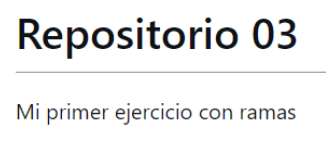

# Repositorio 03
***
Ejercicio con ramas

 
3.1 - Crea un directorio llamado repo03 (tu decides como lo haces) con un fichero  readme.md vacío, haz un commit y súbelo a un repositorio remoto que tendrá el  mismo nombre repo03.
He creado una carpeta he inicializado git dentro con `git init`. Luego he creado el repositorio remoto y lo he vinculado con `git remote add origin https://github.com/celiapdg/repo03`

3.2 - Crea una rama con tu nombre y la fecha (por ejemplo david02032022) desde la  que editaremos el fichero

~~~
git branch celia20220603
~~~

3.3 – Desde tu rama edita el fichero readme.md para que quede de la siguiente manera:

3.4 – Haz un commit en tu rama
~~~
git checkout celia20220603
git add .
git commit -m "added text to readme"
~~~

## Como en la primera ronda no subí la rama a remoto, introduzco esta línea desde la rama celia20220603 para repetir el ejercicio.

3-5 – Fusiona tu rama con master
~~~
git checkout master
git merge celia20220603
~~~

3-6 – Elimina la rama en local

~~~
git branch -d celia20220603
~~~